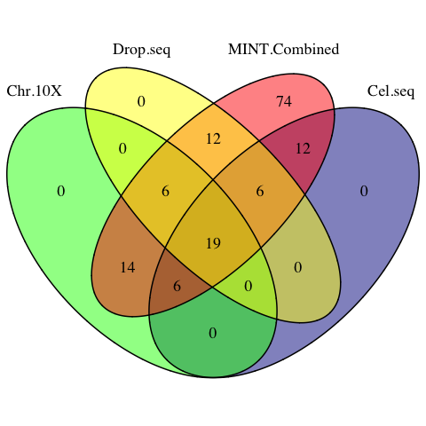
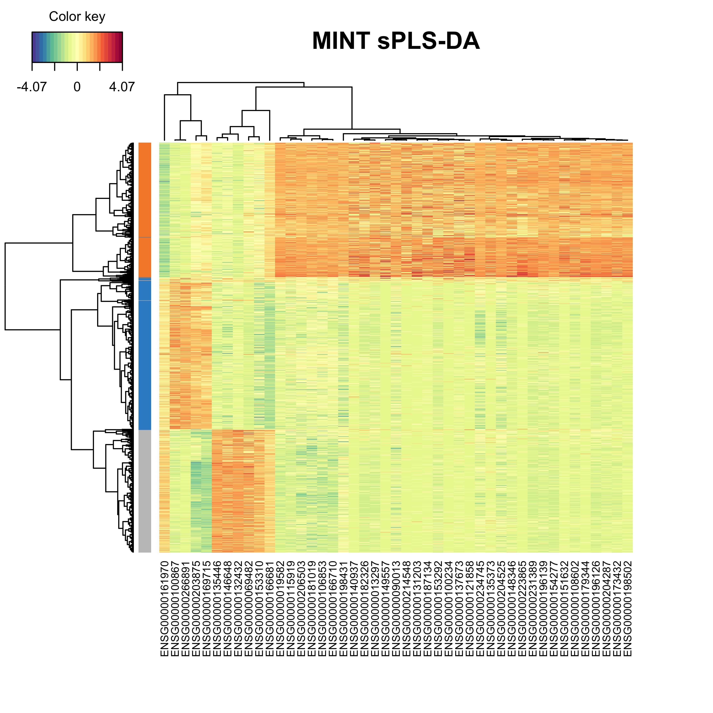

# Identifying Gene Signature using MINT

```{r 2-global, eval=!exists('standalone'), echo=!exists('standalone'), purl=FALSE}
library(knitr)
knitr::opts_chunk$set(warning=FALSE, message=FALSE, cache=TRUE,
                      cache.comments=FALSE, out.width = '55%', 
                      fig.align='center', fig.pos = 'ht')
purlMode=F ## global variable for extracting r code at the end
localData = F ## if data are to be loaded locally into R env
standalone = F ## TRUE if running this Rmd file separately (and not as a book)
```

```{r, eval=standalone, echo=standalone}
## if loading the required input data locally
## input/output directories:
io = list()

## SCE data dir - FALSE for GitHub load:
# io$local.sincell = '../data/sincell_with_class.RData'
io$local.sincell = F # F or a directory

## where to save the run - FALSE for not saving:
# io$save.runs = '../output'
io$save.runs = F # F or a directory

## where to save the R scripts:
io$Rscript.dir = '../R-scripts'

## have the final mint.splsda object saved in io$save.runs for signature analyses?:
io$save.mint.spls = F # T or F

## DE tables directory for signature chapter - FALSE for GitHub load:
# io$DEtables = '../data/DEtable_90cells.RData'
io$DEtables = F # F or a directory
```

## Identifying Molecular Signatures using MINT sPLSDA

This section follows up on the Data Integration vignette. The aim here is to find the gene signature characterising the cell lines using the MINT sPLS-DA model and also to make relevant comparisons.

The following topics are covered in details in the previous vignette and thus will not be expanded:

  + The instructions on installation of the required packages
  + Data normalisation method using *scran* package

## R Scripts

The R scripts are available at [this link](https://github.com/AJABADI/MINT_sPLSDA/blob/master/02-Signature.R).

## Libraries

```{r 2-libs, message=FALSE, eval=standalone, results='hide', warning=FALSE}
## load the required libraries
library(SingleCellExperiment)
library(mixOmics)
library(scran)
library(scater)
library(knitr)
library(VennDiagram)
library(tibble)
```

## Data

The data need to be loaded only if the vignette files are being run separately (and not as a book). The raw and normalised data are loaded from the Data Integration vignette. You can load them directly from github:

```{r 2-loadFromGitHub, eval=standalone&isFALSE(io$local.sincell)}
## load from github
## raw
RawURL='https://tinyurl.com/sincell-with-class-RData-LuyiT'
load(url(RawURL))
```

Alternatively, you can download and load directly into R environment:

```{r 2-localLoad, eval=standalone&!isFALSE(io$local.sincell)}
## or load from local directory, change to your own
load(io$local.sincell)
```

```{r 2-normalise, eval=standalone}
## normalise the QC'ed count matrices
sc10x.norm =  computeSumFactors(sce10x_qc) ## deconvolute using size factors
sc10x.norm =  normalize(sc10x.norm) ## normalise expression values
## DROP-seq
scdrop.norm = computeSumFactors(scedrop_qc_qc)
scdrop.norm = normalize(scdrop.norm)
## CEL-seq2
sccel.norm =  computeSumFactors(sce4_qc)
sccel.norm =  normalize(sccel.norm)
```

## PLS-DA on Each Protocol Individually

Previously, we combined the datasets using MINT sPLS-DA. We then performed variable selection using optimum number of variables for each MINT PLS-DA component to tune the model parameters using key predictors. In this vignette, we will also carry out (s)PLS-DA on each individual dataset (from every protocol) to compare the signatures from individual and combined studies. Next, we will compare the signatures against differentially expressed genes from a univariate analysis from CellBench study.

### The Method

As mentioned in previous vignette, PLS-DA finds the molecular signature that drives the association of cells to their cell lines. Here we use mixOmics' *plsda* function to find the PLSDA components in each dataset, refer to the documentation for details.

### PLSDA

Since our aim is to find the signature from each dataset and compare, we need to find the data corresponding to common genes across all datasets:

```{r 2-listIntersect, eval=standalone}
## find the intersect of the genes
list.intersect = Reduce(intersect, list(
## the rownames of the original (un-transposed) count matrix will output the genes
  rownames(logcounts(sc10x.norm)),
  rownames(logcounts(sccel.norm)),
  rownames(logcounts(scdrop.norm))
))
```

Initially, we apply the function to the 10X data and perform cross validation:

```{r 2-plsda.10x}
## extract the normalised count matrix from the SCE object (transposed)
normalised.10x = t(logcounts(sc10x.norm))
## keep the common genes only for comparability
normalised.10x = normalised.10x[,list.intersect]
## form a factor variable of cell lines
Y.10x = as.factor(sc10x.norm[list.intersect,]$cell_line)
## PLS-DA on the dataset with 5 components
plsda.10x.res = plsda(X = normalised.10x, Y = Y.10x, ncomp = 5)
## perform cross validation and find the classification error rates
start = Sys.time()
perf.plsda.10x = perf(plsda.10x.res, progressBar=FALSE )
run.time = Sys.time()-start
```

The run took less than `r ceiling(run.time)` `r attr(run.time, "units")`. We can now plot the error rate profile:

```{r 2-perfPlot10x, fig.cap=' The classification error rate for different number of PLSDA components of 10X dataset.'}
## optimal number of components
plot(perf.plsda.10x, col = color.mixo(5:7))
```
Similar to the combined dataset, *ncomp*=2 leads to optimum error rate. We now apply *plsda* to the other 2 datasets:

```{r 2-plsdaCellDrop}
## extract the normalised count matrix from the SCE object (transposed)
## CEL-seq2
normalised.cel = t(logcounts(sccel.norm))
normalised.cel = normalised.cel[,list.intersect]
## Drop-seq
normalised.drop= t(logcounts(scdrop.norm))
normalised.drop = normalised.drop[,list.intersect]
## factor variable of cell lines
Y.cel = as.factor(sccel.norm[list.intersect,]$cell_line)
Y.drop = as.factor(scdrop.norm[list.intersect,]$cell_line)
## PLS-DA on each dataset with 2 components
plsda.10x.res = plsda(X = normalised.10x, Y = Y.10x, ncomp = 2)
plsda.cel.res = plsda(X = normalised.cel, Y = Y.cel, ncomp = 2)
plsda.drop.res = plsda(X = normalised.drop, Y = Y.drop, ncomp = 2)
```

We plot the plsda plots for the 10X and CEL-seq2 data:

```{r 2-MINTplots, out.width="65%", fig.cap='PLSDA plot for the 10x dataset.'}
## mint.plsda plot for 10X
plotIndiv(plsda.10x.res,
          legend  = TRUE, title     = 'PLSDA 10X', 
          ellipse = TRUE, legend.title = 'Cell Line',
          X.label = 'PLSDA component 1', 
          Y.label = 'PLSDA component 2', pch=1)
```


```{r 2-MINTplots2, out.width="65%", fig.cap='PLSDA plot for the CEL-seq2 dataset.'}
## mint.plsda plot for CEL-seq2
plotIndiv(plsda.cel.res,
          legend  = TRUE, title     = 'PLSDA CEL-seq2', 
          ellipse = TRUE, legend.title = 'Cell Line',
          X.label = 'PLSDA component 1', 
          Y.label = 'PLSDA component 2', pch=2)
```

The PLSDA figures show clustering by cell line, while the CEL-seq2 data are more scattered compared to 10X. In interpreting the relations, it is important to note that the apparent change of clusters is simply the result of an inversion on second PLSDA component and does not imply disparity per se.

### Sparse PLSDA (sPLSDA) For Each Protocol

For consistency and better comparison, we will use same number of optimum components as MINT for the sparse PLS-DA on each protocol:

```{r 2-sMINTtunedRun}
## run sparse PLSDA on individual studies with MINT tuned parameters
keepX = c(35,10)
splsda.10x.res = splsda( X =normalised.10x, Y = Y.10x, ncomp = 2,  
                              keepX = keepX)
splsda.cel.res = splsda( X =normalised.cel, Y = Y.cel, ncomp = 2,  
                              keepX = keepX)
splsda.drop.res = splsda( X =normalised.drop, Y = Y.drop, ncomp = 2,  
                              keepX = keepX)
```

And visualise the output to see how the clusters change with variable selection:

```{r 2-splsdaPlots1, out.width="65%", fig.cap=' The sPLSDA plots of the 10X dataset.'}
## splsda plots with tuned number of variables for each sPLSDA component
## 10X
plotIndiv(splsda.10x.res, group = Y.10x,
          legend  = TRUE, title     = 'sPLSDA - 10X',
          ellipse = FALSE,legend.title = 'Cell Line',
          pch=1,
          X.label = 'sPLSDA component 1',
          Y.label = 'sPLSDA component 2')

```

```{r 2-splsdaPlots2, out.width="65%", fig.cap=' The sPLSDA plots of the CEL-seq2 dataset.'}
## CEL-seq2
plotIndiv(splsda.cel.res, group = Y.cel,
          legend  = TRUE, title     = 'sPLSDA - CEL-seq2',
          ellipse = FALSE,legend.title = 'Cell Line',
          pch=2,
          X.label = 'sPLSDA component 1',
          Y.label = 'sPLSDA component 2')
```

The variable selection has reduced the noise and refined the clusters compared to the non-sparse model.
 
```{r 2-vennProtocolsVariables}
## The signature genes from each sPLS-DA study
Chromium.10X.vars = unique(c(selectVar(splsda.10x.res, comp=1)$name,
                             selectVar(splsda.10x.res, comp=2)$name))
Cel.seq.vars =      unique(c(selectVar(splsda.cel.res, comp=1)$name,
                             selectVar(splsda.cel.res, comp=2)$name))
Drop.seq.vars =     unique(c(selectVar(splsda.drop.res, comp=1)$name,
                             selectVar(splsda.drop.res, comp=2)$name))
```

```{r 2-vennProtocols, results='hide'}
## create a venn diagram from signatures
vennProtocols <- venn.diagram(
	x = list(
		Chr.10X= Chromium.10X.vars ,
		Cel.seq= Cel.seq.vars,
		Drop.seq = Drop.seq.vars),
	filename = NULL,
	cex=1.5, cat.cex=1.5,
	fill = c('green', 'darkblue',  'yellow')
	)
png(filename = 'figures/vennProtocols.png')
grid.draw(vennProtocols)
dev.off()
```

```{r 2-vennProtocolsShow, eval=TRUE, echo=FALSE, out.width='35%', fig.cap=' The venn diagram of common sPLSDA signatures among individual datasets.', purl=FALSE}
## change to your own directory
include_graphics('figures/vennProtocols.png')
```

The signatures from the 3 studies share 25 common genes.

## Compare with MINT-Combined

In case the vignette is being run separately, the MINT sPLSDA object can be reproduced:

```{r, eval=standalone&!io$save.mint.spls, echo=standalone&!io$save.mint.spls}
data.combined = t( ## transpose of all 3 datasets combined
  data.frame(
    ## the genes from each protocol that match list.intersect
    logcounts(sc10x.norm)[list.intersect,],
    logcounts(sccel.norm)[list.intersect,],
    logcounts(scdrop.norm)[list.intersect,] ))

## create a factor variable of cell lines
## must be in the same order as the data combination
cell.line = as.factor(c(sce10x_qc$cell_line,
                         sce4_qc$cell_line,
                         scedrop_qc_qc$cell_line))
## name the factor variable with the cell ID
names(cell.line) = rownames(data.combined)

## produce a character vector of batch names
## must be in the same order as the data combination
study = as.factor(
  c(rep('10X',      ncol(logcounts(sc10x.norm))),
    rep('CEL-seq2',  ncol(logcounts(sccel.norm))),
    rep('Drop-seq', ncol(logcounts(scdrop.norm))) ))
## name it with corresponding cell IDs
names(study) = rownames(data.combined)

## run sparse mint using optimum parameters:
mint.splsda.tuned.res = mint.splsda( X =data.combined, Y = Y,
                              study = study, ncomp = 2,  
                              keepX = c(35,10))
```

Or directly from your local directory:

```{r 2-load.mint.splsda, eval=standalone&io$save.mint.spls, echo=standalone&io$save.mint.spls}
## change to your own
load(file.path(io$save.runs,'mint.splsda.tuned.res.RData'))
```

### Loading Plots

The consistency of the selected variables across individual and the MINT combined studies can be evaluated by plotting the loadings for each study using the *plotLoadings* function, which produces the barplot of variable loadings for each component.

The inputs to *plotLoadings* depends on the analysis object (mint.*s*plsda, mint.pls, etc.) and consists of the plot object plus:

+ **contrib:** Whether to show the class in which the expression of the features is maximum or minimum. One of *'min'* or *'max'*.
+ **method:** The criterion to assess the contribution. One of *'mean'* or *'median'* (recommended for skewed data).
+ **study:** The studies to be plotted (for combined data). *all.partial* or *global* for all.

For a complete list of the arguments for any object please refer to the documentation.

We plot the loadings for both components for maximum contribution. Colours indicate the class (cell line) in which the gene is positively/negatively expressed:

```{r 2-loadings1, fig.cap='The loading plots for the first component of sPLS-DA on 10X data. The orange colour corresponds to H2228 cells, and the grey colour belongs to HCC827 cell line.'}
## 10X
plotLoadings(splsda.10x.res, contrib='max', method = 'mean', comp=1, 
             study='all.partial', legend=FALSE, title=NULL, 
             subtitle = '10X')
```
```{r 2-loadings2, fig.cap='The loading plots for the first component of sPLS-DA on CEL-seq2 data.'}
## CEL-seq2
plotLoadings(splsda.cel.res, contrib='max', method = 'mean', comp=1, 
             study='all.partial', legend=FALSE, title=NULL,
             subtitle = 'CEL-seq2')
```
```{r 2-loadings3, fig.cap='The loading plots for the first component of sPLS-DA on Drop-seq data.'}
## Drop-seq
plotLoadings(splsda.drop.res, contrib='max', method = 'mean', comp=1, 
             study='all.partial', legend=FALSE, title=NULL,
             subtitle = 'Drop-seq')
```

These genes are differentiating cells along the first sPLSDA component. Majority of signature genes are postively expressed in H2228 cells (orange). There is not a clear consensus among individual datasets in terms of the signature genes and their weight (loading).

```{r 2-loadings4, out.width='65%', fig.cap='The loading plots for the first component of the Sparse MINT on the combined dataset.'}
## MINT Comp. 1
plotLoadings(mint.splsda.res, contrib='max', method = 'mean', comp=1, 
             study='all.partial', legend=FALSE, title=NULL, 
             subtitle = c('10X', 'CEL-seq2', 'Drop-seq') )
```

MINT has produced signature that is consistent across studies. Similarly, we can plot the loadings on the second component variables.

```{r 2-loadingscomp2, out.width='65%', fig.cap='The loading plots for the second component of the Sparse MINT on the combined dataset.'}
## MINT Comp. 2
plotLoadings(mint.splsda.tuned.res, contrib='max', method = 'mean', comp=2, 
             study='all.partial', legend=FALSE, title=NULL, 
             subtitle = c('10X', 'CEL-seq2', 'Drop-seq') )
```

### Signature Comparison

The *selectVar* function in *mixOmics* outputs the key predictors on each component along with their loadings. We can create a set of Venn diagrams to visualise the overlap of the signature found using PLS-DA in individual datasets and the combined dataset. For all datasets, we take all the variables on both components as the signature.

```{r 2-signatures}
## MINT signature
MINT.Combined.vars = unique(c(selectVar(mint.splsda.tuned.res, comp=1)$name,
                             selectVar(mint.splsda.tuned.res, comp=2)$name))
```


```{r 2-vennMINTProduce2, results='hide'}
vennMINT <- venn.diagram(
	x = list(
		Chr.10X= Chromium.10X.vars ,
		Cel.seq= Cel.seq.vars,
		Drop.seq = Drop.seq.vars,
		MINT.Combined=MINT.Combined.vars),
	filename = NULL,
	cex=1.5, cat.cex=1.5,
	fill = c('green', 'darkblue',  'yellow', 'red')
	)
png(filename = 'figures/vennMINT.png')
grid.draw(vennMINT)
dev.off()
```

```{r 2-vennMINTShow, echo=FALSE, fig.cap=' The venn diagram of sPLSDA signatures among individual datasets and the MINT combined dataset.', purl=FALSE}
## change to your own directory

```

```{r 2-comm.sig}
## the signature genes identified by all studies
common.sig = Reduce(intersect, list(MINT.Combined.vars, Chromium.10X.vars, Cel.seq.vars, Drop.seq.vars))
```

MINT has successfully detected the core `r length(common.sig)` signature genes shared by all individual PLSDA models, plus 10 genes identied in 2 out of 3 studies.

```{r 2-comm.sig.show, eval=TRUE}
## the 10 signature genes with highest loadings
common.sig[1:10]
```

### Variable Plots

Using *plotVar* function, it is possible to display the selected variables on a correlation circle plot to find the correlation between gene expressions:

```{r, out.width='55%', fig.asp=0.8, fig.cap='The variable plot highlighting the contribution of each selected variable to each component and their correlation.'}
## correlation circle plot
plotVar(mint.splsda.tuned.res, cex = 3)
```

The figure above shows that majority of the signature genes are positively expressed in component 1.

we can assess the expression profiles for the genes on the extremes of both components:

```{r 2-extreme-genes}
## component 1 - most positively and negatively expressed between cell lines
var.c1 = selectVar(mint.splsda.tuned.res, comp=1)$value
positive.gene.c1 = rownames(var.c1)[which.max(var.c1$value.var)]
negative.gene.c1 = rownames(var.c1)[which.min(var.c1$value.var)]

## component 2 - most positively and negatively expressed between cell lines
var.c2 = selectVar(mint.splsda.tuned.res, comp=2)$value
positive.gene.c2 = rownames(var.c2)[which.max(var.c2$value.var)]
negative.gene.c2 = rownames(var.c2)[which.min(var.c2$value.var)]
```

```{r 2-vilolinfunction}
## a function to create violin + box plots for this specific dataset
violinPlot = function(mint.object, gene){
  cols = c("H2228" = "orange", "H1975" = "dodgerblue3", "HCC827" = "grey")
  ggplot() + 
    geom_boxplot(aes(mint.object$Y,  mint.object$X[,gene],
                     fill= mint.object$Y), alpha=1)+
    geom_violin(aes(mint.object$Y, mint.object$X[,gene],
                     fill= mint.object$Y), alpha=0.7) +
    labs(x = "Cell Line", y="Standardised Expression Value" )+
    guides(fill=guide_legend(title="Cell Line") ) +
    scale_fill_manual(values=cols ) 
}
```
```{r 2-vilolinplotPositive, out.width='50%', fig.cap= "Violin plots of expression profile of the most positively expressed gene on component 1 in different cell lines"}
## violin + box plots for the most positively expressed gene on component 1
violinPlot(mint.splsda.tuned.res, positive.gene.c1)
```
```{r 2-vilolinplotNegative, out.width='50%', fig.cap= "Violin plots of expression profile of the most negatively expressed gene  on component 1 in different cell lines"}
## violin + box plots for the most negatively expressed gene on component 1
violinPlot(mint.splsda.tuned.res, negative.gene.c1)
```

As expected, the expression profile of the above genes for H2228 cell line has opposite correlation to the other two. We can also evaluate the genes of the second sPLS-DA component:

```{r 2-vilolinplotPositive-c2, out.width='50%', fig.cap= "Violin plots of expression profile of the most positively expressed gene on component 2 in different cell lines"}
## violin + box plots for the most positively expressed gene on component 2
violinPlot(mint.splsda.tuned.res, positive.gene.c2)
```
```{r 2-vilolinplotNegative-c2, out.width='50%', fig.cap= "Violin plots of expression profile of the most negatively expressed gene  on component 2 in different cell lines"}
## violin + box plots for the most negatively expressed gene on component 2
violinPlot(mint.splsda.tuned.res, negative.gene.c2)
```

The expression profiles show that the selected gene tends to be negatively expressed in HCC827 cell line and positively expressed in H1975 cell line.

A Clustered Image Map including the final signature can be plotted. The argument *comp* can be also be specified to highlight only the variables selected on specific components.

```{r 2-cimRun}
cim(mint.splsda.tuned.res, comp = c(1,2), margins=c(10,5), 
    row.sideColors = color.mixo(as.numeric(mint.splsda.tuned.res$Y)), row.names = FALSE,
    title = 'MINT sPLS-DA', save='png', name.save = 'heatmap')
```

```{r 2-heatmap, out.width='80%', echo=FALSE,fig.cap='The heatmap showing the cell grouping based on the gene expression profiles.', purl=FALSE}

```

The heatmap shows that the cells from each cell line tend to group together based on their gene expression profile. It can be reiterated that the cells from the H2228 cell line show positive expression in majority of signature genes.

## Signature Comparison with Bulk Assay

### Cell Mixtures Data

The experimental design for CellBench data also included a cell mixture design for a pseudo-trajectory analysis. Briefly, in this study 9 cells were pooled from different cell types in different proportions and then reduced to 1/9th to mimic single cells and were sequenced using CEL-seq2 protocol. A mixture of 90 cells in equal amounts was used as the control group for a Differential Expression (DE) analysis of the pure cell lines at the extreme of trajectories. The results available on [CellBench repository](https://github.com/LuyiTian/CellBench_data/tree/master/data).

```{r 2-cellmixdesign, echo=FALSE, fig.cap='The cell mixture design. Adopted from Luyi Tian slides', purl=FALSE}
knitr::include_graphics('figures/9cellmix.png')
```

We will take DE genes from the cell mixture study as reference for comparison. The DE genes are available on CellBench respository.

```{r 2-mixdata, eval=isFALSE(io$DEtables), message=FALSE}
## load directly from github
DE_URL <- 'https://tinyurl.com/DEtable-90cells'
load(url(DE_URL))
```

```{r 2-DEtables-load, eval=!isFALSE(io$DEtables), echo=!isFALSE(io$DEtables)}
## or load the DEGs from the 'data' folder
load(io$DEtables)
```

### DE Genes vs MINT signature

We now compare the unique signature genes from MINT sPLS-DA analysis to the ones from cell mixture DE analysis:

```{r 2-DEtables-compare}
## keep the genes present in the sPLS-DA analysis
HCC827_DEtable = HCC827_DEtable[row.names(HCC827_DEtable) %in% list.intersect,]
H2228_DEtable = H2228_DEtable[row.names(H2228_DEtable) %in% list.intersect,]
H1975_DEtable = H1975_DEtable[row.names(H1975_DEtable) %in% list.intersect,]

## create a column of genes for ease of merging
HCC827_DE = rownames_to_column(HCC827_DEtable, 'gene')
H2228_DE = rownames_to_column(H2228_DEtable, 'gene')
H1975_DE = rownames_to_column(H1975_DEtable, 'gene')

## create a combined DEtable from the 3 cell lines
DEtable = rbind(HCC827_DE,H2228_DE, H1975_DE)
## order by gene name and FDR (increasing)
DEtable = DEtable[order(DEtable[,'gene'],DEtable[,'FDR']),]
## keep the ones with FDR<0.05
DEtable = DEtable[DEtable$FDR<0.05,]
## remove duplicate gene names
DEtable = DEtable[!duplicated(DEtable$gene),]
## overlap with MINT
DE.MINT = DEtable[(DEtable$gene %in% MINT.Combined.vars),]
## sort in increasing FDR order
DE.MINT = DE.MINT[order(DE.MINT$FDR),]
## number of MINT signature genes that are differentially expressed
dim(DE.MINT)[1]
## geometric mean of the FDR of signature
exp(mean(log(DE.MINT$FDR)))
```

All of signature genes identified by MINT are differentially expressed at FDR<0.05 with geometric mean FDR of  $1.54\times10^{-18}$.

```{r 2-sessionDataSave, eval=FALSE, echo=FALSE}
## run this code if you wish to save the RData for loading
save.image(file = file.path(io$save.runs,'02-Signature.RData'))
```

## Session Information

```{r}
## session information to build this vignette
sessionInfo()
```

```{r 2-purl, eval=FALSE, echo=FALSE, purl=FALSE}
## extract R code
library(knitr)
purlMode=TRUE
standalone=TRUE
purl('02-Signature.Rmd',output =
       ifelse(isFALSE(io$Rscript.dir),
              '02-Signature.R',
              file.path(io$Rscript.dir,'02-Signature.R')),  documentation = 0)
```
