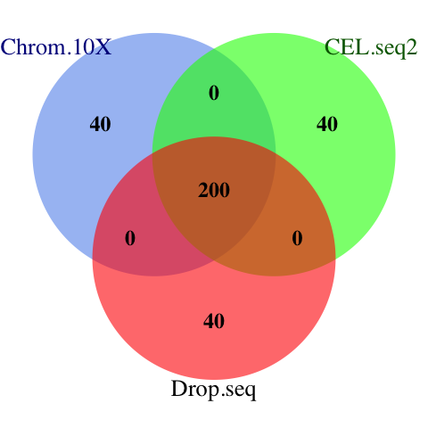
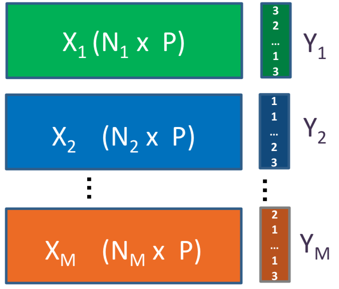

# Single Cell Data Integration Using MINT

```{r, include=F, purl=F}
library(knitr)
knitr::opts_chunk$set(warning=F, message=F, cache=T,
                      cache.comments=F, out.width = '70%', 
                      fig.align='center', fig.pos = 'ht')
purlMode=F ## global variable for extracting R code at the end - must be F here
```


This vignette explains the functionalities of **MINT** (**M**ultivariate **INT**egrative method) [@mint] toolkit in combining datasets from multiple single cell transcriptomic studies on the same cell types. The integration is across the common *P* features. Hence, we call this framework **P-Integration**. We will also illustrate why Prinicipal Component Analysis might not be as powerful in such setting. It is worth mentioning that *MINT* can be used to combine datasets from any types of similar 'omics studies (transcriptomics, proteomics, metabolomics, etc) on the samples which share common features. For integration across different omics you can use [DIABLO](http://mixomics.org/mixdiablo/).

## prerequisites

*mixOmics* [@R-mixOmics] and the following Bioconductor/R packages must be installed for this vignette:

```{r, echo=F, message=F, results='hide', warning=F}
## installing the required packages for this vignette if necessary
required.pkgs = c('mixOmics',
                  'SingleCellExperiment', ## single-cell experiment data analysis
                  'scran', ## sc-RNAseq data analysis
                  'VennDiagram', ## Venn diagrams
                  'tibble') ## for data tables

## installing BiocManager to install packages
## it can install CRAN packages as well
if (!requireNamespace('BiocManager', quietly = T)){
  paste('Trying to install BiocManager')
  install.packages('BiocManager')
}
## package installer function - only if it is not installed.
package.installer = function(pkgs=required.pkgs){
  for (package in pkgs){
    if (!requireNamespace(package, quietly = T)){
  paste0('Trying to install ', package)
  BiocManager::install(package, update = F)
    }
    }
}
## run function
package.installer(required.pkgs)
```

If any issues arise during package installations, you can check out the [troubleshoots] section.

## why MINT?

Different datasets often contain different levels of unwanted variation that come from factors other than biology of study (e.g. differences in the technology, protocol, etc.) known as batch effects. The *MINT* framework presented in this vignette is an integrative method that helps to find the common structures in the combined dataset which best explain their biological class membership (cell type), and thus can potentially lead us to insightful signatures.
For further examples on bulk data, you can also check out a case study on [mixOmics' website](http://mixomics.org/mixmint/stemcells-example/).

## when not to use MINT?

Current version of *MINT* performs supervised data integration. Therefore, the phenotypes/cell types must be known prior to data integration using this method.

## R scripts

The R scripts are available at [this link](https://github.com/AJABADI/MINT_sPLSDA/tree/master/Rscripts).

## libraries

Here we load the libraries installed in [prerequisites]:
```{r, message=F}
## load the required libraries
library(SingleCellExperiment)
library(mixOmics)
library(scran)
library(knitr)
library(VennDiagram)
library(tibble)
```

## data

Here we set up the input and output specified in *params* section of *yaml*. By default, all required data are loaded from GitHub and run data are not saved.

```{r}
check.exists <- function(object) ## function to assess existence of objects
{
  exists(as.character(substitute(object)))
}

## input/output from parameters
io = list()

## whether or where from to locally load data - FALSE: GitHub load; or a directory
io$local.input = ifelse(check.exists(params$local.input), params$local.input, F)

## whether or where to save run data - FALSE: do not save; or a directory
io$output.data = ifelse(check.exists(params$output.data), params$output.data, F)

## whether or where to save R scripts - FALSE: do not save; or a directory
io$Rscripts=ifelse(check.exists(params$Rscripts), params$Rscripts, F)
```

The benchmark data - available on [GitHub](https://github.com/LuyiTian/CellBench_data) - were obtained from our collaborators Luyi Tian and Dr Matt Ritchie at WEHI. Briefly, cells from three human cell lines H2228, H1975, HCC827 collected on lung tissue (Adenocarcinoma; Non-Small Cell Lung Cancer) were barcoded and pooled in equal amounts. The samples were then processed through three different types of 3' end sequencing protocols that span the range of isolation strategies available:

* Droplet-based capture with:
    + Chromium 10X (10X Genomics)
    + Drop-seq (Dolomite).
* Plate based isolation of cells in microwells with CEL-seq2.

Therefore, in addition to the biological variability coming from three distinct and separately cultured cell lines, the datasets are likely to also contain different layers of technical variability coming from three sequencing protocols and technologies.

```{r, echo=F, out.width='45%', fig.cap='Benchmark experiment design: mixture of the three pure cells in equal proportion, processed through 3 different sequencing technologies. Adopted from Luyi Tian slides.', purl=F}
include_graphics('figures/exp_design3.png')
```

Throughout this vignette, the terms *batch*, *protocol*, and *study* are used interchangeably.

## loading the data

We can load the data either directly from the [GitHub repository](https://github.com/LuyiTian/CellBench_data/tree/master/data) or from local directory into R environment:

```{r, eval=!F}
if (isFALSE(io$local.input)){
  ## load from GitHub
  DataURL='https://tinyurl.com/sincell-with-class-RData-LuyiT'
  load(url(DataURL))
} else {
  stopifnot(dir.exists(io$local.input))
  load(file.path(io$local.input, 'sincell_with_class.RData'))
}
```


```{r, echo=F, purl=F}
## load the subset of data if desired
if (!isFALSE(params$subset.data)){
  load(params$subset.data)
}
```


**Tip**: For convenience, throughout the runs you may also want to save the finalised RData file from each section using the *save* function for easy loading using *load* function in the downstream analyses (refer to R documentation for more details).

The loaded datasets consist of:

+ *sce_sc_10x_qc*: From the Chromium 10X technology;
+ *sce_sc_CELseq2_qc*: From the CEL-seq2 technology; and
+ *sce_sc_Dropseq_qc*: From the Drop-seq technology (quality controlled twice due to abundant outliers).

Each dataset is of *SingleCellExperiment (SCE)* class, which is an extension of the [*RangedSummarizedExperiment*](https://www.rdocumentation.org/packages/SummarizedExperiment/versions/1.2.3/topics/RangedSummarizedExperiment-class) class. For more details see the [package's vignette](https://bioconductor.org/packages/devel/bioc/vignettes/SingleCellExperiment/inst/doc/intro.html) or refer to the R Documentation.

### quality control

The data have been quality controlled using [*scPipe* package](https://bioconductor.org/packages/release/bioc/html/scPipe.html). It is a Bioconductor package that can handle data generated from all 64 popular 3’ end scRNA-seq protocols and their variants [@R-scPipe].

### overview

we now stratify the cell and gene data by cell line in each protocol.

```{r}
## make a summary of QC'ed cell line data processed by each protocol
sce10xqc_smr =  summary(as.factor(sce_sc_10x_qc$cell_line))
sce4qc_smr =    summary(as.factor(sce_sc_CELseq2_qc$cell_line))
scedropqc_smr = summary(as.factor(sce_sc_Dropseq_qc$cell_line))
## combine the summaries
celline_smr = rbind(sce10xqc_smr,sce4qc_smr,scedropqc_smr)
## produce a 'total' row as well
celline_smr = cbind(celline_smr, apply(celline_smr,1,sum))
## add the genes as well
celline_smr = cbind(celline_smr,
                    c(dim(counts(sce_sc_10x_qc))[1],
                      dim(counts(sce_sc_CELseq2_qc))[1],
                      dim(counts(sce_sc_Dropseq_qc))[1]))
## label the rows
row.names(celline_smr) = c('10X', 'CEL-seq2', 'Drop-seq')
colnames(celline_smr) = c('H1975', 'H2228', 'HCC827', 
                          'Total Cells','Total Genes')
```
```{r}
## tabulate the summaries
kable(celline_smr,
      caption = 'Summary of cell and gene data 
      per cell line for each protocol')
```

The assignment to each cell line was performed computationally based on the correlation of the gene expression data with a bulk assay of a mixture of cells by DE analysis using [*edgeR*](https://bioconductor.org/packages/release/bioc/html/edgeR.html).

```{r, include=F}
## show the cell line summaries
celline_smr
```

The 10X protocol yielded the highest number of cellls (~900). We can visualise the the total amount of genes in each protocol and the amount of overlapping genes among the protocols using a venn diagram:

```{r, results='hide'}
## create venn diagram of genes in each protocol:
venn.plot = venn.diagram(
  x = list(Chrom.10X = rownames(sce_sc_10x_qc),
           CEL.seq2 = rownames(sce_sc_CELseq2_qc),
           Drop.seq = rownames(sce_sc_Dropseq_qc)),
  filename = NULL, label=T, margin=0.05,
  height = 1400, width = 2200,
  col = 'transparent', fill = c('cornflowerblue','green', 'red'),
  alpha = 0.60, cex = 2, fontfamily = 'serif', fontface = 'bold',
  cat.col = c('darkblue', 'darkgreen', 'black'), cat.cex = 2.2)

## save the plot, change to your own directory
png(filename = 'figures/GeneVenn.png')
grid.draw(venn.plot)
dev.off()
```
```{r, echo=F, out.width='40%', fig.cap=' The venn diagram of common genes among datasets. MINT uses the common features of all datasets for discriminant analysis.', purl=F}
## change to your own directory

```

A total of 13757 genes are shared across three datasets.

### normalisation

Normalisation is typically required in RNA-seq data analysis prior to downstream analysis to reduce heterogeneity among samples due to technical artefact as well as to help to impute the missing values using known data.

We use the [*scran* package](http://bioconductor.org/packages/release/bioc/html/scran.html)'s "Normalisation by deconvolution of size factors from cell pools" method [@scnorm]. It is a two-step process, in which the size factors are adjusted, and then the expression values are normalised:

```{r}
## normalise the QC'ed count matrices
sc10x.norm =  computeSumFactors(sce_sc_10x_qc) ## deconvolute using size factors
sc10x.norm =  normalize(sc10x.norm) ## normalise expression values
## DROP-seq
scdrop.norm = computeSumFactors(sce_sc_Dropseq_qc)
scdrop.norm = normalize(scdrop.norm)
## CEL-seq2
sccel.norm =  computeSumFactors(sce_sc_CELseq2_qc)
sccel.norm =  normalize(sccel.norm)
```

Depending on the data structure and/or the question in hand the following analyses can have one of the following two forms:

+ **Unsupervised Analysis:** Where we want to explore the patterns among the data and find the main directions that drive the variations in the dataset. **It is often beneficial to perform unsupervised analysis prior to supervised analysis to assess the presence of outliers and/or batch effects**.

+ **Supervised Analysis:** In which each sample consists of a pair of feature measurements (e.g. gene counts) and class membership (e.g. cell type). The aim is to build a model that maps the measurements to their classes using a training set which can adequately predict classes in a test set as well.

We will start with Unsupervised Analysis and then proceed to Supervised Analysis.

## PCA: unsupervised analysis

We start by Principal Component Analysis (PCA) [@pca]. It is a dimension reduction method which seeks for components that maximise the variance within the datasets.  PCA is primarily used to explore one single type of ‘omics data (e.g. transcriptomics, proteomics, metabolomics data, etc). It is an unsupervised learning method and thus there is no assumption of data corresponding to any class (batch, study etc).

```{r, out.width='40%', echo=F, fig.cap='An example of principal components for data with only 2 dimensions. The first PC is along the direction of maximum variance.', purl=F}
## pca example
include_graphics('figures/pca.png')
```

The first Principal Component (PC) explains as much variance in the data as possible, and each following PC explains as much of the remaining variance as possible, in a direction orthogonal to all previous PCs. Thus, the first few components often capture the main variance in a dataset.

We will perform PCA on the datasets from each protocol separately and then conduct a PCA on the concatenated dataset.

### PCA on each protocol individually

We will use *mixOmics*'s *pca* function in this section. The method is implemented numerically and it is capable of dealing with datasets with or without missing values (see documentation for details). The *pca* function takes the data as a matrix of count data. Contrary to conventional biological data formation, *pca* takes each row to be the gene expression profile of a molecule/cell. Therefore, we will have to transpose the normalised matrix (using the *t()* function) to perform PCA. Additionally, we use the log transformed counts (*logcounts()*) to confine the counts' span for numerical reasons. 

By default, *mixOmics* centres the normalised matrix to have zero mean. The *scale* argument can also be set to 'TRUE' if there are diverse units in raw data.

The *ncomp* argument denotes the number of desired PCs to find[^1]. We will retrieve 10 PCs for each protocol at this stage:

[^1]: More arguments: *max.iter, tol, logratio, multilevel*.

```{r}
## pca on the normalised count matrices and find 10 PCs
pca.res.10x =     pca(t(logcounts(sc10x.norm)),  ncomp = 10,
                      center=T, scale=F)
pca.res.celseq =  pca(t(logcounts(sccel.norm)),  ncomp = 10,
                      center=T, scale=F)
pca.res.dropseq = pca(t(logcounts(scdrop.norm)), ncomp = 10,
                      center=T, scale=F)
```

Each output is a *pca* object that includes the centred count matrix for that protocol, the mean normalised counts for each gene, the PCA loadings, and score values.

```{r, include=F}
## details of the pca output
pca.res.10x
```

It is possible to use the *plot* function on *pca* object to visualise the proportion of the total variance of the data explained by each of the 10 PCs for each protocol using a barplot:

```{r, out.width='100%',fig.asp= 0.4, fig.cap= 'The pca barplot for each protocol. (A) The first 2 PCs explain 20\\% of total variability of the data and there is a drop (elbow) in the explained variability afterwards. (B) The first 2 PCs explain 10\\% of variability and an elbow is not apparent. (C) similar cumulative explained variance to CEL-seq2 for first 2 PCs.'}

## arrange the plots in 1 row and 3 columns
par(mfrow=c(1,3))
## find the maximum explained variance in all PCs:
ymax = max (pca.res.10x$explained_variance[1],
             pca.res.celseq$explained_variance[1],
             pca.res.dropseq$explained_variance[1])

## plot the pca objects and limit the Y axes to ymax for all
plot(pca.res.10x, main= '(A) 10X', ylim=c(0,ymax))
plot(pca.res.celseq,  main= '(B) CEL-seq2', ylim=c(0,ymax))
plot(pca.res.dropseq,  main= '(C) Drop-seq', ylim=c(0,ymax))
```

It will usually be desirable if the first few PCs capture sufficient variation in the data, as this will help with visualisation.

In order to have a simple 2D scatter plot, the first 2 PCs are usually the ones of interest in PCA plots[^2]. Such a plot can be created using the *plotIndiv* function. For a complete list of the argument options refer to the documentation.

[^2]: Using the "style='3d'" argument, one can also plot the 3d PCA plot with 3 components

We will colour the data points of each cell line using *group* argument to see whether there is a differentiation between different cell types:

```{r}
## define custom colours/shapes
## colour by cell line
col.cell = c('H1975'='#0000ff', 'HCC827'='grey30', 'H2228' ='#ff8000')
## shape by batch
shape.batch = c('10X' = 1, 'CEL-seq2'=2, 'Drop-seq'=3 )
```

```{r, fig.asp= 0.8, out.width='50%', fig.cap= 'PCA plot for the 10X dataset. The data tend to group together by cell lines.'}
## pca plots for protocols
## 10x
plotIndiv(pca.res.10x, legend = T, title = 'PCA 10X', pch = shape.batch['10X'], col = col.cell,
          group = sce_sc_10x_qc$cell_line, legend.title = 'Cell Line')
```

PCA plot for 10X data shows that the H2228 cells are most differentiated from others along the first PC, while the other two are located similarly along this PC. The 3 clusters are separated along the second PC. The Drop-seq data have been quality controlled twice and still exhibit two clusters. One possible explanation is the existence of doublets (droplets with 2 cells). This highlights the importance of carefully tuning the experiment parameters.

```{r, fig.asp= 0.8, out.width='50%',fig.cap= 'The PCA plots for the CEL-seq2 data. The data are widely scattered in the 2D plane while H2228 cells are relatively distant from the other two.'}
## CEL-seq2
plotIndiv(pca.res.celseq, legend = T, title = 'PCA CEL-seq2', pch = shape.batch['CEL-seq2'],
          col = col.cell, group = sce_sc_CELseq2_qc$cell_line, legend.title = 'Cell Line')
```

```{r,fig.asp= 0.8,out.width='50%', fig.cap= 'The PCA plots for the Drop-seq data. While H2228 and HCC827 cell data tend to cluster by cell line, the H1975 data exhibit two clusters with negative correlation (on opposite sides of origin). The within-data variation is not consistent between datasets. For instance, the 10X data show a clear grouping structure by cell lines, while this observation is not as strongly supported in other datasets. '}
## Drop-seq
plotIndiv(pca.res.dropseq, legend = T, title = 'PCA Drop-seq', pch = shape.batch['Drop-seq'],
          col = col.cell, group = sce_sc_Dropseq_qc$cell_line, legend.title = 'Cell Line')
```

## PCA on the combined dataset

We now pool/concatenate the datasets for unsupervised analysis. First we should find out the common genes across the three datasets, as a requirement for **P-Integration**:

```{r}
## find the intersect of the genes for integration
list.intersect = Reduce(intersect, list(
## the rownames of the original (un-transposed) count matrix will -
## output the genes
  rownames(logcounts(sc10x.norm)),
  rownames(logcounts(sccel.norm)),
  rownames(logcounts(scdrop.norm))
))
```

Now we can merge the 3 datasets:

```{r}
## combine the data at their intersection
data.combined = t( ## transpose of all 3 datasets combined
  data.frame(
    ## the genes from each protocol that match list.intersect
    logcounts(sc10x.norm)[list.intersect,],
    logcounts(sccel.norm)[list.intersect,],
    logcounts(scdrop.norm)[list.intersect,] ))
## the number of cells and genes in the intersect dataset
dim(data.combined)
```

This matrix includes the count data for the combined dataset. We will also create 2 vectors of the cell lines and batches for visualisation of the PCA plots, and also later for the PLS-DA analysis:

```{r}
## create a factor variable of cell lines
## must be in the same order as the data combination
cell.line = as.factor(c(sce_sc_10x_qc$cell_line,
                         sce_sc_CELseq2_qc$cell_line,
                         sce_sc_Dropseq_qc$cell_line))
## name the factor variable with the cell ID
names(cell.line) = rownames(data.combined)

## produce a character vector of batch names
## must be in the same order as the data combination
batch = as.factor(
  c(rep('10X',      ncol(logcounts(sc10x.norm))),
    rep('CEL-seq2',  ncol(logcounts(sccel.norm))),
    rep('Drop-seq', ncol(logcounts(scdrop.norm))) ))
## name it with corresponding cell IDs
names(batch) = rownames(data.combined)
```

We can now perform PCA and visualise the results:

```{r}
## perform PCA on concatenated data and retrieve 2 PCs
pca.combined = pca(data.combined, ncomp = 2)
```

```{r, out.width='60%',fig.cap= 'The PCA plot for the combined data, coloured by cell lines.' }
## plot the combined pca coloured by batches
plotIndiv(pca.combined, title = 'PCA Combined',
          pch = batch, ## shape by cell line
          group = cell.line, ## colour by batch
          legend = T, legend.title = 'Cell Line',
          legend.title.pch = 'Study')
```

```{r, out.width='60%', fig.cap= 'The PCA plot for the combined data, coloured by protocols.'}
## plot the combined pca coloured by protocols
plotIndiv(pca.combined, title = 'PCA Combined',
          pch = cell.line, ## shape by cell line
          group = batch, ## colour by protocol
          col.per.group = c('red', 'purple', 'green'),
          legend = T, legend.title = 'Study',
          legend.title.pch = 'Cell Line')
```

As shown in combined PCA plots above, the protocols are driving the variation along PC1 (batch effects), while wanted biological variation is separating the data along PC2. We will next implement the MINT PLS-DA method on the combined dataset with an aim to account for the batch effects in discriminating the different cell types.

## MINT to combine the datasets

*MINT* uses **Projection to Latent Structures - Discriminant Analysis** to build a learning model on the basis of a training dataset. Such a predictive model is expected to accurately classify the samples with unknown cell types in an external learning dataset.

```{r, echo=F, out.width='30%',  fig.cap='P-integration framework using MINT for M independent studies (X) on the same P features. In this setting Y is a vector indicating the class of each cell.', purl=F}

```

### method

*MINT* finds a set of discriminative latent variables (in this context, **linear combinations of gene expression values**) simultaneously in all the datasets, thus leading to PLS-DA Components (as opposed to PCs in PCA) most influenced by consistent biological heterogeneity across the studies. Therefore, these components do not necessarily maximise the variance among the pooled data like what PCs do, but maximise covariance between the combined data and their classes (cell lines).

The *mint.plsda* function in *mixOmics* has a set of inputs to perform the analysis, including:

+ **X**: Which is the original predictor matrix.
+ **Y**: Factor of classes (here, cell lines).
+ **study**: Factor indicating the membership of each sample to each of the studies/batches being combined.
For a detailed list of functions available with *MINT* refer to the documentation.

Since PLS-DA is a supervised method, we initially create a vector to assign each sample to its class/cell.line (Y) and then perform *MINT*, keeping 5 PLS-DA components:

```{r}
## create variables needed for MINT
## factor variable of cell lines
Y = as.factor(cell.line[rownames(data.combined)])
## factor variable of studies
study = batch ## defined in the combined PCA section
## MINT on the combined dataset with 5 components
mint.plsda.res = mint.plsda(X = data.combined, Y = Y,
                             study = study, ncomp = 5)
```

The outcome is a *mint.plsda* object which can be plotted using *plotIndiv* function:

```{r, out.width='50%', fig.cap='The MINT PLS-DA plot for the combined dataset. Data points are coloured by cell lines.'}
## plot the mint.plsda plots for the combined dataset
plotIndiv(mint.plsda.res, group = cell.line,
          legend  = T, subtitle     = 'MINT - Coloured by Cell Line',
          ellipse = F, legend.title = 'Cell Line',
          legend.title.pch = 'protocol',
          X.label = 'PLS-DA component 1',
          Y.label = 'PLS-DA component 2')
```

As seen in the PLS-DA plots, the data are differentiated mainly by their cell lines. The effects of batches are not fully eliminated yet.
 
### optimum number of components

We can look at the calassification error rates over the chosen number of components (5) using *perf* function in *mixOmics*, which evaluates the performance of the fitted PLS models internally using Leave-One-Group-Out Cross Validation (LOGOCV) in *MINT* (M-Fold Cross-Validation is also available). Refer to the documentation for more details about *perf* arguments.

```{r}
## perform cross validation and calculate classification error rates
set.seed(12321)  # for reproducibility of the results
perf.mint.plsda.res = perf(mint.plsda.res,
          progressBar = F)
```

We now plot the output:

```{r, out.width='50%',fig.cap='The classification error rate for different number of PLS-DA components showing Balanced and Overall Error Rates, each comprising three distance measures. The distances measure how far any given data point is from the mean of its class.'}
## plot the classification error rate vs number of components
plot(perf.mint.plsda.res, col = color.mixo(5:7))
```

As seen in the plot above, at ncomp = 2 the model has the optimum performance for all distances in terms of Balanced and Overall Error Rate, as there is not a considerable drop in error rates for further components (see supplemental information from [@R-mixOmics] for more details about the prediction distances).
Additional numerical outputs are available to stratify the error rates per cell line/protocol/distance measure:

```{r}
perf.mint.plsda.res$global.error$BER ## further error diagnostics 
```

Also, the function outputs the optimal number of components via the *choice.ncomp* attribute. 

```{r}
## number of variables to select in each component
perf.mint.plsda.res$choice.ncomp
```

### sparse MINT PLS-DA

At this section, we investigate the performance of *MINT* with variable selection (we call it sparse MINT PLSDA or MINT sPLS-DA). This helps by eliminating the noisy variables (here genes) from the model to better interpret the signal coming from the primary variables. At this stage, we will ask the model to keep 50 variables with highest loadings on each component.
The number of variables to keep should be set as a vector into *keepX* argument in *mint.splsda* (refer to the documentation for more details):

```{r}
## number of variables to keep in each component
list.keepX = c(50,50) 
## perform sparse PLS-DA using MINT with 2 components
mint.splsda.res = mint.splsda(X = data.combined, Y = Y,
                              study = study, ncomp = 2, keepX = list.keepX)
```

Plot the sparse *MINT* object:

```{r, out.width='50%', fig.cap='The Sparse MINT PLS-DA plot for the combined dataset. Data points are coloured by cell lines.'}
plotIndiv(mint.splsda.res,
          legend  = T, subtitle = 'Sparse MINT', ellipse = T,
          X.label = 'sPLS-DA component 1', 
          Y.label = 'sPLS-DA component 2',
          group = Y, ## colour by cell line
          legend.title = 'Cell Line',
          legend.title.pch = 'Protocol')
```

The clusters are now more refined compared to the non-sparse method. The effects of batches are now almost removed, and the samples from the 10X dataset seem equally differentiated as the others.

### choice of parameters

Previously, we chose 50 variables for a sparse analysis. The optimal number of the variables can be determined for each component using the *tune* function. The *test.keepX* argument specifies a vector of the candidate numbers of variables in each PLS-DA component to be evaluated. Here, we will only try 5,10,...,35 variables to save on time, and also record the runtime. It is recommended to use a coarse and wide grid first (e.g. seq(10,300,10)) and refine it once the right neighbourhood is known.  We will separately tune each component for better visualisation but tuning can be done in one step for all components.

```{r}
## tune MINT for component 1 and then 2 and record the run time
## we tune individual components for visualisation purposes
## one can run only the tune.mint.c2 without already.tested.X
start.time = Sys.time()
## tune using a test set of variable numbers
## component 1
tune.mint.c1 = tune(
  X = data.combined, Y = Y, study = study, ncomp = 1,
  ## assess numbers 5,10,15...35:
  test.keepX = seq(5,35,5), method = 'mint.splsda',
  ## use all distances to estimate the classification error rate
  dist = c('max.dist',  'centroids.dist', 'mahalanobis.dist'),
  progressBar = F
)
## component 1 to 2
tune.mint.c2 = tune(
  X = data.combined, Y = Y, study = study, ncomp = 2,
  ## already tuned component 1
  already.tested.X = tune.mint.c1$choice.keepX,
  test.keepX = seq(5,35,5), method = 'mint.splsda',
  dist = c('max.dist',  'centroids.dist', 'mahalanobis.dist'),
  progressBar = F
)
end.time = Sys.time()
## see how long it takes to find the optimum number of variables:
run.time =  end.time - start.time
```

It took less than `r ceiling(run.time)` minutes to evaluate the chosen test set of variables using a 2.6 GHz Dual-core Intel Core i5 processor (8GB RAM). It is always more practical to look into a coarse grid at first and then refine it when the right neighbourhood is found. We now look at the optimum number of components chosen and their corresponding Balanced Error Rate:

```{r, out.width='100%',fig.asp=0.3, fig.align='left', fig.cap='The Balanced Error Rate as a function of number of variables in PLS-DA components 1 (left) and 2 (right). '}
## look at the optimal selected variables for each PC
tune.mint.c2$choice.keepX
## plot the error rates for all test variable numbers
par(mfrow=c(1,3))
plot(tune.mint.c1, col = 'darkred')
plot(tune.mint.c2, col = 'darkblue')
```

The optimum numbers of variables for each component are shown using a diamond mark in plots above, which are `r tune.mint.c2$choice.keepX[1]` for the first and `r tune.mint.c2$choice.keepX[2]` for the second one.

We now re-run the sparse *MINT* using optimum parameters:

```{r}
## run sparse mint using optimum parameters:
mint.splsda.tuned.res = mint.splsda( X =data.combined, Y = Y,
                              study = study, ncomp = 2,  
                              keepX = tune.mint.c2$choice.keepX)
```

Next, we plot the *mint.splsda* object with global variables (for the combined dataset):

```{r, out.width='50%', fig.cap='The tuned MINT sPLS-DA plot for the combined data. While there are still a number of samples that are not well classified, the clusters are more refined when we perform variable selection.'}
## plot the tuned mint.splsda plot for the combined dataset
plotIndiv(mint.splsda.tuned.res, study = 'global', legend = T,
          title = 'MINT sPLS-DA',  subtitle = 'Global', ellipse=T, legend.title = 'Cell Line')
```

We can also look at the dataset per protocol using *all.partial* as the input for the *study* argument:

```{r, out.width='100%', fig.cap='MINT sPLS-DA components for each individual protocol coloured by cell line.'}
## tuned mint.splsda plot for each protocol
plotIndiv(mint.splsda.tuned.res, study = 'all.partial',  title = 'MINT sPLS-DA', 
          subtitle = c('10X', 'CEL-seq2', 'Drop-seq'))
```

The majority of samples from the 10X data are well classified, while the method struggles to classify some samples from H1975 samples in the Drop-seq and CEL-seq2 datasets.

### performance assessment

We now can evaluate the classification performance of the final model using *perf* function. We will use the maximum distance measure.

```{r}
set.seed(12321)  # for reproducibility of the results
## perform classification with leave-one-group-out cross validation 
perf.mint.final = perf(mint.splsda.res, progressBar = F, dist = 'max.dist')
## classification error rate
perf.mint.final$global.error
```

The balanced and overall error rates are 1.2 and 1.3 percent respectively, while the model classifies the H2228 cell types with zero error rate.


### ROC curves

Another available visualisation tool is the ROC (Receiver Operating Characteristic) curves for each study (or all) to evaluate the prediction accuracy of a classification mode. In a ROC curve the true positive rate (Sensitivity) is plotted against the false positive rate (100-Specificity) for different classification thresholds. This method should be interpreted carefully in such multivariate analysis where no clear cut-off threshold can be considered.

```{r, out.width='50%', results='hide'}
## ROC curves for both components
auc.mint.splsda1 = auroc(mint.splsda.tuned.res, roc.comp = 1, roc.study='CEL-seq2')
auc.mint.splsda2 = auroc(mint.splsda.tuned.res, roc.comp = 2, roc.study='CEL-seq2')
```

For a perfect model the curve would go through the upper left corner, while the black line represents a perfectly random classification model.

ROC plots show that for CEL-seq data, the model has relatively low prediction accuracy for HCC827 and H1975 samples in the first component, while it has high prediction accuracy for all samples in the second component. This was also apparent in sPLS-DA plot, as HCC827 and H1975 samples were not separated along the first PLSDA component for CEL-seq data, while most of samples were differentiated along the second component by their cell lines.

```{r, eval=!isFALSE(io$output.data), echo=F}
## if specified, save the run data
if (!isFALSE(io$output.data)){
  ## save normlaised sce objects
  sce.norm = c('sc10x.norm', 'sccel.norm', 'scdrop.norm')
  save(list=sce.norm,  file = file.path(io$output.data,'sce.norm.RData'))
  ## save the final mint object
  save(mint.splsda.tuned.res, file =file.path(io$output.data,'mint.splsda.tuned.res.RData'))
  ## save the rest of the data separately
  session01 = ls()
  session01 = session01[!session01 %in% c(sce.norm, 'mint.splsda.tuned.res')]
  save(session01, file =file.path(io$output.data,'session.integration.RData'))
}
```


```{r, eval=!isFALSE(io$Rscripts), echo=F, purl=F, results='hide'}
if (!isFALSE(io$Rscripts))
{
  ## extract R code
  library(knitr)
  purlMode=T
  purl('01-Data-Integration.Rmd',output =file.path(io$Rscripts,'01-Data-Integration.R'),  documentation = 0)
  purlMode=F
}
  
```

## session information

```{r}
writeLines(capture.output(sessionInfo()), "sessionInfo.md")
## session information to build this vignette
sessionInfo()
```


## troubleshoots

### Bioconductor
You can check out [Bioconductor's troubleshoot page](https://bioconductor.org/install/#troubleshoot-bioconductor-packages)

### mixOmics
In case you are having issues with *mixOmics*, please look it up at the [mixOmics issues page](https://bitbucket.org/klecao/package-mixomics/issues) and if you did not find your solution, create a new issue. You can also check out or submit your questions on [stackoverflow forums](https://stackoverflow.com/search?q=mixomics).

### mac OS

* __Compilation error while installing libraries from binconductor__ This could be due to the fortran compiler not being updated for newer R versions. You can go to [this website](https://thecoatlessprofessor.com/programming/rcpp-rcpparmadillo-and-os-x-mavericks--lgfortran-and--lquadmath-error/) and get the instructions on how to install the latest gfortran for your R and mac OS version.

* __Unable to import *rgl* library __
Ensure you have the [latest version of XQuartz](https://www.xquartz.org/) installed.